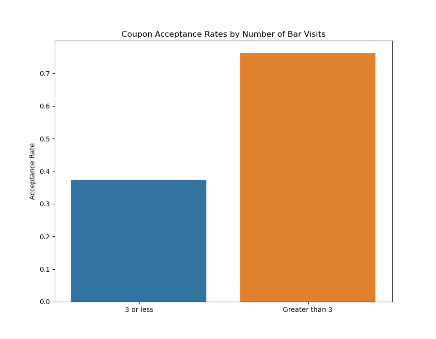
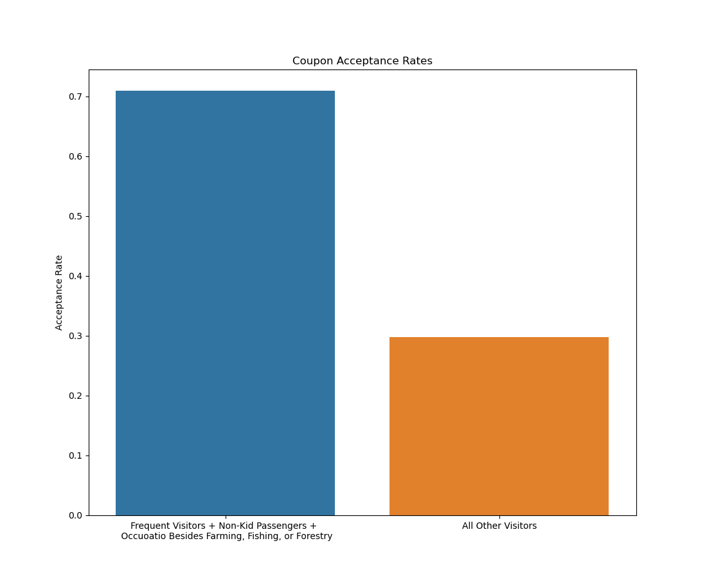
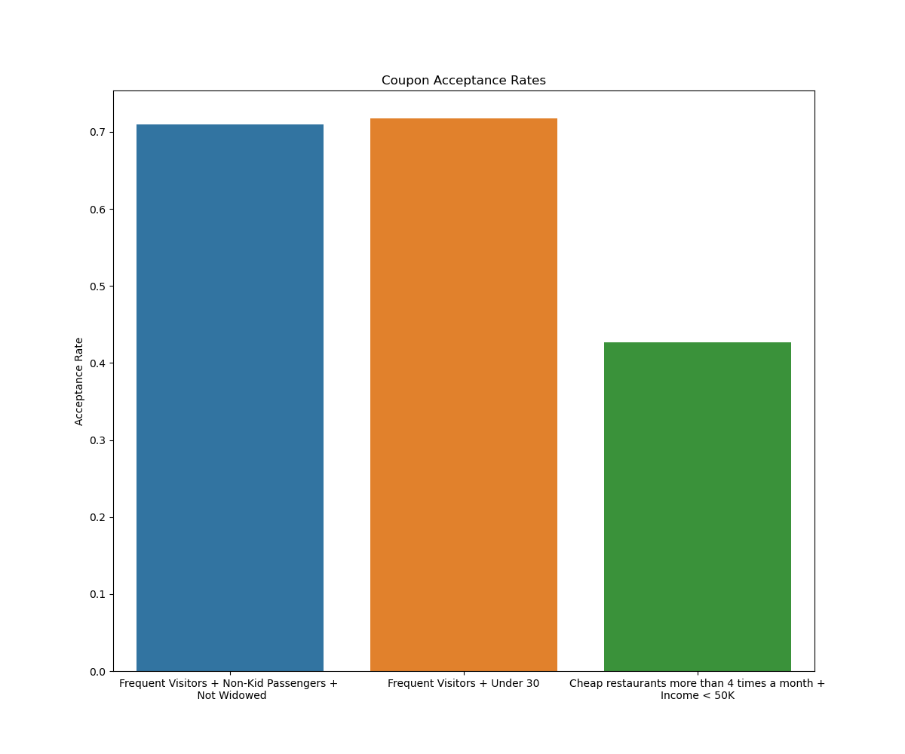
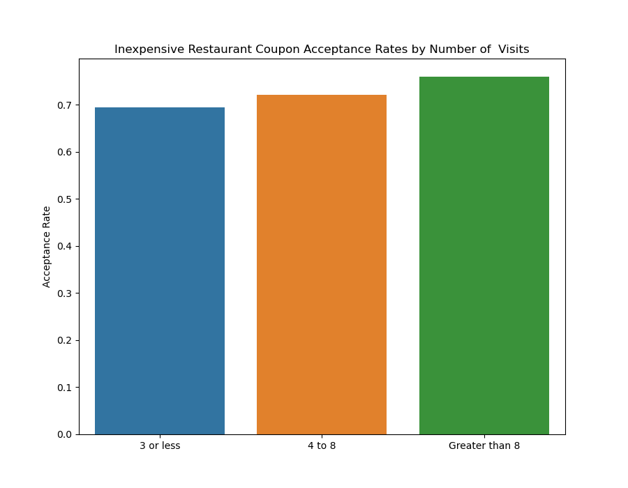
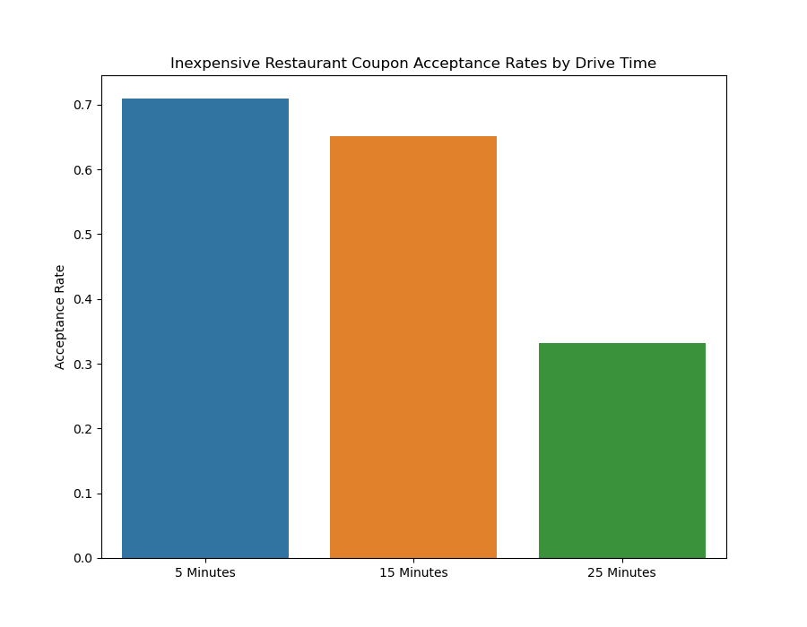
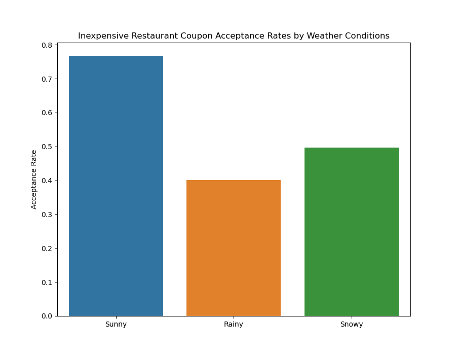
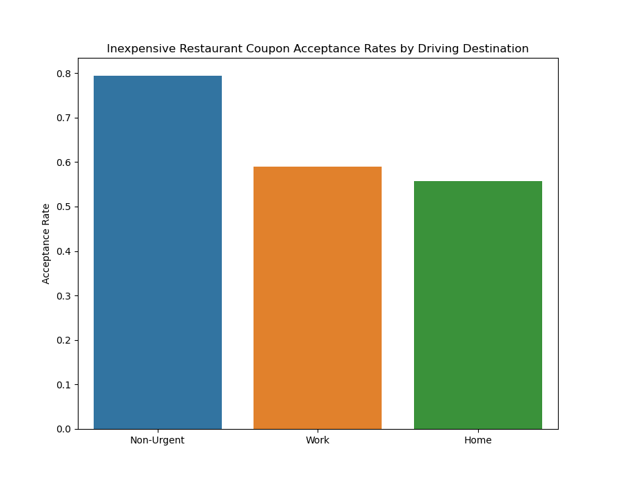

# Berekeley ML Cert - Module 5 - Practical App 5.1
Will a Customer Accept the Coupon? The goal of this project is to use visualizations and probability distributions to distinguish between customers who accepted a driving coupon versus those that did not.

[The Project Notebook](coupon_acceptance.ipynb)

## Data
This data comes from the UCI Machine Learning repository and was collected via a survey on Amazon Mechanical Turk. The survey describes different driving scenarios, including the destination, current time, weather, passenger, etc., and then asks people whether they will accept the coupon if they are the driver. Answers given that the users will drive there “right away” or “later before the coupon expires” are labeled as “Y = 1”, and answers “no, I do not want the coupon” are labeled as “Y = 0”. There are five different types of coupons—less expensive restaurants (under $20), coffee houses, carry out and take away, bars, and more expensive restaurants ($20–$50).

## Findings

### Bar Coupons

1. The number of visits is a big driver of bar coupon acceptance rates. Drivers who have visited a bar more than three times in the last month are almost twice as likely to accept a bar coupon.
   
2. Age is a factor for bar coupon acceptance rates. Acceptance rates for older frequent bar visitors was almost 69% compared to a 39% acceptance rate for others.
   
3. Acceptance rates for drivers who go to a bar more than once a month, with non-child passengers, and have occupations other than farming, fishing, or forestry accept bar coupons are 71%. For all other drives the acceptance rate is 40%.
   
4. The frequent bar visitors' high acceptance rate holds even when other factors are considered such as age less than 30, not widowed, and non-kid passengers.
5. One set of drivers with a lower coupon acceptance rate, approximately 43%, are the ones who frequently visit cheap restaurants and have an income less that $50K.
   

##### Bar Coupons - Next Steps and Recommendations

1. More research is needed to find a way to increase coupon acceptance rates for those who visit bars less than once a month.
2. Assuming a driving app on phones has some demographic and location tracking data, find ways to send bar coupons to those who are more likely to accept them: older drivers who visit bars frequently.

### Inexpensive Restaurant Coupons

1. Inexpensive restaurant coupons have an acceptance rate of 71%
2. The number of visits does not seem to greatly affect the inexpensive coupon acceptance rate. The acceptance rate increased slightly as the number of visits increased.
   
3. Driving distance is obviously a factor in inexpensive restaurant coupon acceptance rates. Acceptance rates for 5 to 15 minute drive time stayed relatively high (71% and 65% respectively). However the acceptance rate basically dropped in half, down to 33%, when the drive time rose to 25 minutes.
   
4. Good weather is a strong factor for inexpensive restaurant coupoon acceptance rates:
    * Acceptance rate for sunny weather: 77%
    * Acceptance rate for rainy weather: 40%
    * Acceptance rate for snowy weather: 50%
      
5. A non-urgent driving destination is a strong factor for inexpensive restaurant coupoon acceptance rates:
    * Acceptance rate for non-urgent destination: 79%
    * Acceptance rate for work destination: 59%
    * Acceptance rate for home: 56%
      

##### Inexpensive Restaurant Coupons - Next Steps and Recommendations

1. Assuming the majority of drive destinations are probably to work and home, more research is needed to find ways to increase coupon acceptance rates for those drives.
2. Assuming a driving app on phones has awareness of weather conditions and the driving destination, tracking location data wile using a mapping app, find ways to send coupons when the conditions are ripe for acceptance.

3. Further investigation to see why the inexpensive coupon acceptance rate is so high.
